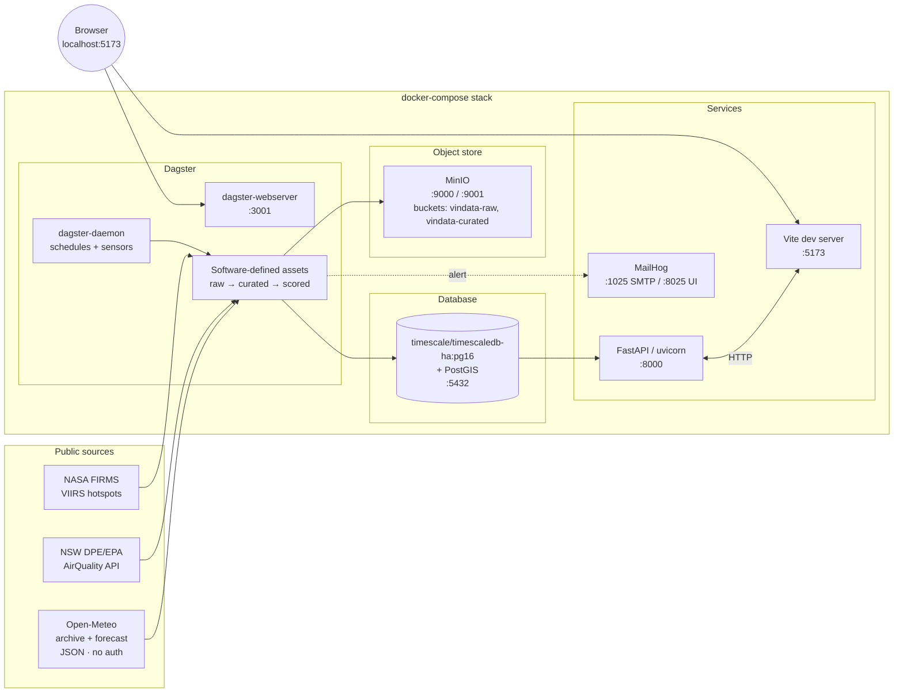

# VinData — Stage 00 Architecture (Local Docker PoC)

> **Stage 00 ≠ Stage 01.** Stage 00 is a *laptop-runnable proof of concept* that lets us prove the end-to-end pipeline (ingest → curate → model → API → UI) with **zero cloud spend** and zero AWS waiting. Stage 01 (in [`../stage-01/`](../stage-01/)) is the cloud-targeted MVP. The same container images and same source tree feed both stages — the only difference between them is environment configuration.
>
> Companion docs in this directory:
> - [`PHASES.md`](./PHASES.md) — phased delivery + success criteria
> - [`LOCAL-DEV.md`](./LOCAL-DEV.md) — getting it running on your machine
> - [`IMPROVEMENTS.md`](./IMPROVEMENTS.md) — deltas vs the original research doc

---

## 1. Why local-Docker first

The Stage 01 critique surfaced four risks that all become *cheap to retire* on a laptop:

1. **Native-deps packaging** (cfgrib/ecCodes for GRIB2, GDAL for PostGIS clients) — surface bugs in `docker compose up`, not in a 3-minute Lambda container deploy.
2. **TimescaleDB + PostGIS together** — official `timescale/timescaledb-ha:pg16` image bundles both; identical to RDS Postgres + extension.
3. **S3 redistribution legality** — local MinIO has no redistribution surface at all; the question simply doesn't apply until we deploy to AWS.
4. **Iteration speed on the agronomy models** — hindcasting frost across 5 years of Orange AWS data is slow on Lambda (cold starts, 15 min limit) and snappy on a laptop with a hot Postgres connection.

The trade we're making: ~3–5 days of harness work up front in exchange for ~10× faster inner loop and ~A$300 saved during build. **Crucially, the harness is not throwaway** — every container we run locally has a 1:1 AWS counterpart.

| Local (Stage 00) | AWS (Stage 01) | Migration cost |
|---|---|---|
| `timescale/timescaledb-ha:pg16` container | RDS Postgres 16 + Timescale + PostGIS | env var |
| MinIO container | S3 | env var (`S3_ENDPOINT`) |
| Dagster (OSS, self-hosted) | Dagster Cloud or Dagster on ECS | deploy target |
| FastAPI in container (uvicorn) | FastAPI on Lambda Web Adapter (same image) | entrypoint |
| MailHog | SES | SMTP host swap |
| No auth (`X-Dev-User` header) | Cognito | router middleware swap |
| Vite dev server | Cloudflare Pages | build → upload |

---

## 2. Component diagram (Stage 00)



### Service responsibilities

| Service | Image / source | Port | Role |
|---|---|---|---|
| `postgres` | `timescale/timescaledb-ha:pg16` | 5432 | Single store: vineyards, forecasts, scores, alerts. Hypertables on `weather_forecasts`. PostGIS for vineyard geometries. |
| `minio` | `minio/minio:latest` | 9000 (API) / 9001 (console) | S3-compatible blob for raw + curated parquet. |
| `mc-init` | `minio/mc:latest` | — | One-shot: creates buckets `vindata-raw`, `vindata-curated`. Exits 0. |
| `mailhog` | `mailhog/mailhog:latest` | 1025 (SMTP) / 8025 (UI) | Captures outbound alerts. |
| `dagster-webserver` | local image (`apps/ingest`) | 3001 | Dagster UI + GraphQL. |
| `dagster-daemon` | local image (`apps/ingest`) | — | Schedules + sensors + run launcher. |
| `api` | local image (`apps/api`) | 8000 | FastAPI + uvicorn. Hot-reload via mount. |
| `web` | `node:22-alpine` | 5173 | Vite dev server. Hot-reload. |

---

## 3. Source tree

```
vindata/
├── README.md
├── LICENSE
├── Makefile                       # canonical commands: make up | make down | make seed | make test
├── .env.example
├── .editorconfig
├── .gitignore
├── .pre-commit-config.yaml        # ruff, prettier, trailing-whitespace, eof-newline
├── docker-compose.yml
├── docker-compose.override.yml    # dev-only mounts for hot-reload (gitignored optional)
├── package.json                   # root, workspace declarations
├── pnpm-workspace.yaml
├── turbo.json
├── tsconfig.base.json
├── pyproject.toml                 # uv workspace root, defines tool config
├── uv.lock
│
├── apps/
│   ├── api/                       # FastAPI service
│   │   ├── pyproject.toml
│   │   ├── Dockerfile
│   │   ├── alembic.ini
│   │   ├── alembic/versions/
│   │   ├── src/vindata_api/
│   │   │   ├── __init__.py
│   │   │   ├── main.py
│   │   │   ├── settings.py
│   │   │   ├── db.py
│   │   │   ├── models/            # SQLAlchemy 2.0 ORM
│   │   │   ├── schemas/           # Pydantic v2
│   │   │   ├── routers/
│   │   │   │   ├── health.py
│   │   │   │   ├── vineyards.py
│   │   │   │   └── scores.py
│   │   │   └── deps.py
│   │   └── tests/
│   │
│   ├── ingest/                    # Dagster project
│   │   ├── pyproject.toml
│   │   ├── Dockerfile
│   │   ├── workspace.yaml
│   │   ├── src/vindata_ingest/
│   │   │   ├── __init__.py
│   │   │   ├── definitions.py     # Dagster Definitions object
│   │   │   ├── resources/
│   │   │   │   ├── minio.py
│   │   │   │   ├── postgres.py
│   │   │   │   └── http.py
│   │   │   ├── assets/
│   │   │   │   ├── raw_open_meteo.py
│   │   │   │   ├── curated_forecast.py
│   │   │   │   └── frost_score.py
│   │   │   ├── schedules.py
│   │   │   └── sensors.py
│   │   └── tests/
│   │
│   └── web/                       # React SPA
│       ├── package.json
│       ├── tsconfig.json
│       ├── vite.config.ts
│       ├── index.html
│       ├── tailwind.config.ts
│       └── src/
│           ├── main.tsx
│           ├── App.tsx
│           ├── api/client.ts      # generated from openapi.json
│           ├── components/
│           │   ├── AdvisoryBanner.tsx
│           │   ├── VineyardMap.tsx
│           │   └── FrostChart.tsx
│           ├── pages/
│           │   ├── OverviewPage.tsx
│           │   └── VineyardPage.tsx
│           └── lib/queryClient.ts
│
├── packages/
│   └── agronomy/                  # pure Python, no I/O
│       ├── pyproject.toml
│       ├── src/agronomy/
│       │   ├── __init__.py
│       │   ├── version.py
│       │   ├── frost.py
│       │   ├── disease/           # stubs for Stage 01
│       │   ├── smoke.py           # stub
│       │   ├── phenology/         # stubs
│       │   └── thresholds.py
│       └── tests/
│           └── test_frost.py
│
├── data/                          # gitignored, mounted into MinIO for fixtures
│   └── fixtures/
│
├── scripts/
│   ├── seed_db.py                 # inserts 6 vineyards (Cargo Road + 5)
│   ├── gen_openapi.sh             # api → openapi.json → web typed client
│   └── hindcast_frost.py          # one-shot validation runner
│
└── docs/
    └── plan/{stage-00,stage-01}/
```

---

## 4. Data model (PoC subset)

Only what's needed to ship the frost wedge end-to-end. Disease/smoke/phenology tables are added in later phases.

```sql
-- pgcrypto + postgis + timescaledb extensions
CREATE EXTENSION IF NOT EXISTS pgcrypto;
CREATE EXTENSION IF NOT EXISTS postgis;
CREATE EXTENSION IF NOT EXISTS timescaledb;

CREATE TABLE vineyards (
  id          smallserial PRIMARY KEY,
  slug        text UNIQUE NOT NULL,
  name        text NOT NULL,
  region      text NOT NULL DEFAULT 'Orange NSW',
  centroid    geography(point, 4326) NOT NULL,
  tz          text NOT NULL DEFAULT 'Australia/Sydney',
  created_at  timestamptz NOT NULL DEFAULT now()
);

CREATE TABLE blocks (
  id            serial PRIMARY KEY,
  vineyard_id   int NOT NULL REFERENCES vineyards(id) ON DELETE CASCADE,
  name          text NOT NULL,
  cultivar      text,
  geom          geography(polygon, 4326),
  elevation_m   real,
  aspect_deg    real,
  slope_deg     real,
  UNIQUE (vineyard_id, name)
);

CREATE TABLE weather_forecasts (
  vineyard_id   int  NOT NULL REFERENCES vineyards(id),
  model         text NOT NULL,            -- 'open_meteo' | 'access_c' | ...
  init_ts       timestamptz NOT NULL,     -- forecast cycle init
  valid_ts      timestamptz NOT NULL,     -- valid time
  t2m           real, dewpoint real, rh real,
  wind_ms       real, wind_dir real,
  precip_mm     real, cloud_frac real, sw_rad real,
  PRIMARY KEY (vineyard_id, model, init_ts, valid_ts)
);
SELECT create_hypertable('weather_forecasts', 'valid_ts', chunk_time_interval => interval '7 days');

CREATE TABLE agronomy_scores (
  vineyard_id    int  NOT NULL REFERENCES vineyards(id),
  block_id       int  REFERENCES blocks(id),
  wedge          text NOT NULL,           -- 'frost' (PoC), later: 'dm','pm','botrytis','smoke','pheno'
  ts             timestamptz NOT NULL,
  lead_h         smallint NOT NULL,
  score          real NOT NULL,
  level          text NOT NULL CHECK (level IN ('low','elevated','high','extreme')),
  inputs         jsonb NOT NULL,
  model_version  text NOT NULL,
  created_at     timestamptz NOT NULL DEFAULT now(),
  PRIMARY KEY (vineyard_id, wedge, ts, lead_h, COALESCE(block_id, -1))
);
SELECT create_hypertable('agronomy_scores', 'ts', chunk_time_interval => interval '30 days');
```

> Stage 00 deliberately omits `users`, `user_vineyard`, `alerts`, and `audit_log`. They're trivial Alembic migrations once we add auth in Stage 01. Keeping the PoC schema small makes the seed and ETL obvious.

---

## 5. API endpoints (Stage 00)

```
GET  /v1/health                               -> { "status": "ok", "db": "ok", "minio": "ok" }
GET  /v1/vineyards                            -> [{ id, slug, name, centroid }]
GET  /v1/vineyards/{id}                       -> { id, slug, name, blocks: [...] }
GET  /v1/vineyards/{id}/forecast?hours=72     -> [{ valid_ts, t2m, ... }]
GET  /v1/vineyards/{id}/scores?wedge=frost    -> [{ ts, lead_h, score, level }]
GET  /openapi.json                            -> generated; consumed by web client codegen
```

OpenAPI spec is the contract. `apps/web/src/api/client.ts` is generated by `openapi-typescript` from a build step. No hand-rolled types on the frontend.

---

## 6. Frost wedge (the one we ship end-to-end at Stage 00)

**Inputs** per forecast cycle, per vineyard, per `valid_ts`:
- `t2m`, `dewpoint`, `wind_ms`, `cloud_frac` from Open-Meteo `/v1/forecast`.

**Algorithm** (FFST-style radiation cooling, simplified for PoC):

```
Tmin_pred(valid_ts) = Tdewpoint
                    - k * sqrt(hours_since_sunset)
                    * (1 - c_cloud * cloud_frac)
                    * (1 - c_wind * min(wind_ms, 4))
```

Defaults: `k = 1.6`, `c_cloud = 0.7`, `c_wind = 0.25`. These are placeholders calibrated against a tiny Orange AWS sample at PoC time; Stage 01 hindcast will refit on 5 years of 063303.

**Output**: `score = clip(0, 1, (2 - Tmin_pred) / 4)`; level mapping `<0.25 low`, `0.25–0.5 elevated`, `0.5–0.75 high`, `>0.75 extreme`. No alert-firing at Stage 00 (just a chart on the SPA). Stage 01 adds SES emails.

The score is computed by the Dagster `frost_score` asset, which is the **downstream** of the `curated_forecast` asset. The asset graph is the source of truth for lineage.

---

## 7. Improvements vs the research doc and Stage 01 plan

(Full deltas in [`IMPROVEMENTS.md`](./IMPROVEMENTS.md). The big ones:)

1. **Open-Meteo only at Stage 00**, not BoM ACCESS-C. cfgrib/ecCodes packaging adds 2–3 days; Open-Meteo gives the same fields via JSON in 5 minutes. Source is via an adapter so swapping in BoM later is a single class.
2. **Dagster software-defined assets** instead of EventBridge + Lambda + Step Functions. Same DAG, vastly better local DX, native lineage UI. We carry it to Stage 01.
3. **`uv` for Python dep mgmt** (not pip / Poetry). Lockfile-based, ~10× faster, single tool for venvs + tasks.
4. **Single Postgres for everything** (no DuckDB / Athena lookalike at PoC). 6 vineyards × 168 forecast hours × hourly cycles is < 10 MB / month. Premature lakehouse is the single biggest waste in the original research doc.
5. **No auth at Stage 00**. The middleware boundary is a single `current_user` dependency that returns a hardcoded admin user. Stage 01 swaps it for Cognito JWT verification.
6. **`make` as the canonical entrypoint**, not a constellation of npm scripts + python scripts. `make up`, `make down`, `make seed`, `make test`, `make hindcast`. Discoverable, language-agnostic.
7. **OpenAPI-generated TS client**, not hand-rolled. Drift is impossible; refactor confidence is high.
8. **Pre-commit hooks** (ruff, prettier, eof-newline) gating commits. Removes a class of PR review noise.

---

## 8. What's deliberately out of scope for Stage 00

- Disease (DM/PM/Botrytis), smoke-taint, and phenology models — schemas exist as stubs but not implemented.
- AWS deployment / Terraform.
- Auth, user management, RBAC.
- Alerting (email digests).
- The other 5 vineyards' precise coordinates (we seed Cargo Road plus 5 placeholders within ~5 km of Mount Canobolas; user confirms coords later).
- Hindcast-grade frost calibration (we use literature-default coefficients; Stage 01 refits).
- Cloudflare Pages / Workers (Vite dev server is enough at PoC).
