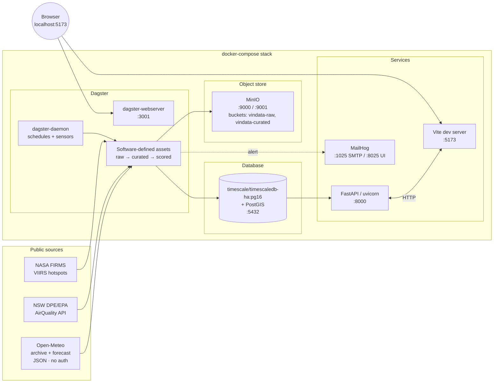

# VinData — Stage 00 Architecture (Local Docker PoC)

> **Stage 00 ≠ Stage 01.** Stage 00 is a *laptop-runnable proof of concept* that lets us prove the end-to-end pipeline (ingest → curate → model → API → UI) with **zero cloud spend** and zero AWS waiting. Stage 01 (in [`../stage-01/`](../stage-01/)) is the cloud-targeted MVP. The same container images and same source tree feed both stages — the only difference between them is environment configuration.
>
> Companion docs in this directory:
> - [`PHASES.md`](./PHASES.md) — phased delivery + success criteria
> - [`LOCAL-DEV.md`](./LOCAL-DEV.md) — getting it running on your machine
> - [`IMPROVEMENTS.md`](./IMPROVEMENTS.md) — deltas vs the original research doc

---

## 1. Why local-Docker first

The Stage 01 critique surfaced four risks that all become *cheap to retire* on a laptop:

1. **Native-deps packaging** (cfgrib/ecCodes for GRIB2, GDAL for PostGIS clients) — surface bugs in `docker compose up`, not in a 3-minute Lambda container deploy.
2. **TimescaleDB + PostGIS together** — official `timescale/timescaledb-ha:pg16` image bundles both; identical to RDS Postgres + extension.
3. **S3 redistribution legality** — local MinIO has no redistribution surface at all; the question simply doesn't apply until we deploy to AWS.
4. **Iteration speed on the agronomy models** — hindcasting frost across 5 years of Orange AWS data is slow on Lambda (cold starts, 15 min limit) and snappy on a laptop with a hot Postgres connection.

The trade we're making: ~3–5 days of harness work up front in exchange for ~10× faster inner loop and ~A$300 saved during build. **Crucially, the harness is not throwaway** — every container we run locally has a 1:1 AWS counterpart.

| Local (Stage 00) | AWS (Stage 01) | Migration cost |
|---|---|---|
| `timescale/timescaledb-ha:pg16` container | RDS Postgres 16 + Timescale + PostGIS | env var |
| MinIO container | S3 | env var (`S3_ENDPOINT`) |
| Dagster (OSS, self-hosted) | Dagster Cloud or Dagster on ECS | deploy target |
| FastAPI in container (uvicorn) | FastAPI on Lambda Web Adapter (same image) | entrypoint |
| MailHog | SES | SMTP host swap |
| No auth (`X-Dev-User` header) | Cognito | router middleware swap |
| Vite dev server | Cloudflare Pages | build → upload |

---

## 2. Component diagram (Stage 00)



### Service responsibilities

| Service | Image / source | Port | Role |
|---|---|---|---|
| `postgres` | `timescale/timescaledb-ha:pg16` | 5432 | Single store: vineyards, forecasts, scores, alerts. Hypertables on `weather_forecasts`. PostGIS for vineyard geometries. |
| `minio` | `minio/minio:latest` | 9000 (API) / 9001 (console) | S3-compatible blob for raw + curated parquet. |
| `mc-init` | `minio/mc:latest` | — | One-shot: creates buckets `vindata-raw`, `vindata-curated`. Exits 0. |
| `mailhog` | `mailhog/mailhog:latest` | 1025 (SMTP) / 8025 (UI) | Captures outbound alerts. |
| `dagster-webserver` | local image (`apps/ingest`) | 3001 | Dagster UI + GraphQL. |
| `dagster-daemon` | local image (`apps/ingest`) | — | Schedules + sensors + run launcher. |
| `api` | local image (`apps/api`) | 8000 | FastAPI + uvicorn. Hot-reload via mount. |
| `web` | `node:22-alpine` | 5173 | Vite dev server. Hot-reload. |

---

## 3. Source tree

```
vindata/
├── README.md
├── LICENSE
├── Makefile                       # canonical commands: make up | make down | make seed | make test
├── .env.example
├── .editorconfig
├── .gitignore
├── .pre-commit-config.yaml        # ruff, prettier, trailing-whitespace, eof-newline
├── docker-compose.yml
├── docker-compose.override.yml    # dev-only mounts for hot-reload (gitignored optional)
├── package.json                   # root, workspace declarations
├── pnpm-workspace.yaml
├── turbo.json
├── tsconfig.base.json
├── pyproject.toml                 # uv workspace root, defines tool config
├── uv.lock
│
├── apps/
│   ├── api/                       # FastAPI service
│   │   ├── pyproject.toml
│   │   ├── Dockerfile
│   │   ├── alembic.ini
│   │   ├── alembic/versions/
│   │   ├── src/vindata_api/
│   │   │   ├── __init__.py
│   │   │   ├── main.py
│   │   │   ├── settings.py
│   │   │   ├── db.py
│   │   │   ├── models/            # SQLAlchemy 2.0 ORM
│   │   │   ├── schemas/           # Pydantic v2
│   │   │   ├── routers/
│   │   │   │   ├── health.py
│   │   │   │   ├── vineyards.py
│   │   │   │   └── scores.py
│   │   │   └── deps.py
│   │   └── tests/
│   │
│   ├── ingest/                    # Dagster project
│   │   ├── pyproject.toml
│   │   ├── Dockerfile
│   │   ├── workspace.yaml
│   │   ├── src/vindata_ingest/
│   │   │   ├── __init__.py
│   │   │   ├── definitions.py     # Dagster Definitions object
│   │   │   ├── resources/
│   │   │   │   ├── minio_io.py
│   │   │   │   ├── postgres.py
│   │   │   │   ├── open_meteo.py
│   │   │   │   ├── airquality.py  # NSW DPE Air Quality
│   │   │   │   └── firms.py       # NASA FIRMS
│   │   │   ├── assets/
│   │   │   │   ├── raw_open_meteo.py
│   │   │   │   ├── raw_air_quality.py
│   │   │   │   ├── raw_firms.py
│   │   │   │   ├── curated_forecast.py
│   │   │   │   ├── phenology_state.py    # runs before disease/smoke
│   │   │   │   ├── frost_score.py
│   │   │   │   ├── disease_score.py      # DM / PM / Botrytis
│   │   │   │   └── smoke_score.py
│   │   │   ├── checks/
│   │   │   │   ├── curated_forecast_checks.py
│   │   │   │   └── score_checks.py
│   │   │   └── schedules.py
│   │   └── tests/
│   │
│   └── web/                       # React SPA
│       ├── package.json
│       ├── tsconfig.json
│       ├── vite.config.ts
│       ├── index.html
│       ├── tailwind.config.ts
│       └── src/
│           ├── main.tsx
│           ├── App.tsx
│           ├── api/client.ts      # generated from openapi.json
│           ├── components/
│           │   ├── AdvisoryBanner.tsx
│           │   ├── VineyardMap.tsx
│           │   ├── FrostChart.tsx
│           │   ├── Sparkline.tsx       # pure-SVG sparkline used by every card
│           │   ├── WedgeCard.tsx       # generic card shell
│           │   ├── FrostCard.tsx
│           │   ├── DiseaseCard.tsx     # DM + PM + Botrytis
│           │   ├── SmokeCard.tsx
│           │   └── PhenologyCard.tsx
│           ├── pages/
│           │   ├── OverviewPage.tsx
│           │   └── VineyardPage.tsx    # 4-card grid + detailed FrostChart
│           └── lib/queryClient.ts
│
├── packages/
│   └── agronomy/                  # pure Python, no I/O, ≥97% coverage
│       ├── pyproject.toml
│       ├── notebooks/
│       │   ├── hindcast.py        # SILO Orange tile multi-wedge replay
│       │   └── results/hindcast.json
│       ├── src/agronomy/
│       │   ├── __init__.py
│       │   ├── version.py
│       │   ├── thresholds.py
│       │   ├── frost.py
│       │   ├── smoke.py
│       │   ├── disease/
│       │   │   ├── lwd.py             # NEWA CART proxy
│       │   │   ├── dmcast.py
│       │   │   ├── gubler_thomas.py
│       │   │   └── broome_botrytis.py
│       │   └── phenology/
│       │       ├── gdd.py             # Winkler + Huglin
│       │       ├── caffarra_eccel.py  # BBCH chilling+forcing
│       │       ├── fao56_eto.py
│       │       └── swb.py             # single-bucket SWB
│       └── tests/
│           ├── test_frost.py
│           ├── test_phenology_*.py    # 4 files, 1 per phenology module
│           ├── test_disease_*.py      # 4 files (lwd + 3 wedges)
│           ├── test_smoke.py
│           └── test_stubs.py
│
├── data/                          # gitignored, mounted into MinIO for fixtures
│   └── fixtures/
│
├── scripts/
│   ├── seed_db.py                 # inserts 6 vineyards (Cargo Road + 5)
│   ├── gen_openapi.sh             # api → openapi.json → web typed client
│   └── hindcast_frost.py          # one-shot validation runner
│
└── docs/
    └── plan/{stage-00,stage-01}/
```

---

## 4. Data model (PoC subset)

Stage 00 ships **all four wedges** end-to-end (frost · disease · smoke · phenology). The 0001 migration creates the core tables; 0002 adds the per-block phenology state, the PM2.5 observations hypertable, and the FIRMS hotspot store.

```sql
-- pgcrypto + postgis + timescaledb extensions
CREATE EXTENSION IF NOT EXISTS pgcrypto;
CREATE EXTENSION IF NOT EXISTS postgis;
CREATE EXTENSION IF NOT EXISTS timescaledb;

CREATE TABLE vineyards (
  id          smallserial PRIMARY KEY,
  slug        text UNIQUE NOT NULL,
  name        text NOT NULL,
  region      text NOT NULL DEFAULT 'Orange NSW',
  centroid    geography(point, 4326) NOT NULL,
  tz          text NOT NULL DEFAULT 'Australia/Sydney',
  created_at  timestamptz NOT NULL DEFAULT now()
);

CREATE TABLE blocks (
  id            serial PRIMARY KEY,
  vineyard_id   int NOT NULL REFERENCES vineyards(id) ON DELETE CASCADE,
  name          text NOT NULL,
  cultivar      text,
  geom          geography(polygon, 4326),
  elevation_m   real,
  aspect_deg    real,
  slope_deg     real,
  UNIQUE (vineyard_id, name)
);

CREATE TABLE weather_forecasts (
  vineyard_id   int  NOT NULL REFERENCES vineyards(id),
  model         text NOT NULL,            -- 'open_meteo' | 'access_c' | ...
  init_ts       timestamptz NOT NULL,     -- forecast cycle init
  valid_ts      timestamptz NOT NULL,     -- valid time
  t2m           real, dewpoint real, rh real,
  wind_ms       real, wind_dir real,
  precip_mm     real, cloud_frac real, sw_rad real,
  PRIMARY KEY (vineyard_id, model, init_ts, valid_ts)
);
SELECT create_hypertable('weather_forecasts', 'valid_ts', chunk_time_interval => interval '7 days');

-- 0001: agronomy_scores has a surrogate BIGINT id PK and a unique
-- constraint with NULLS NOT DISTINCT so we can upsert vineyard-level
-- (block_id NULL) and block-level rows in the same table without
-- TimescaleDB's hypertable PK rules getting in the way.
CREATE TABLE agronomy_scores (
  id             bigint GENERATED BY DEFAULT AS IDENTITY PRIMARY KEY,
  vineyard_id    int  NOT NULL REFERENCES vineyards(id),
  block_id       int  REFERENCES blocks(id),
  wedge          text NOT NULL,
  ts             timestamptz NOT NULL,
  lead_h         smallint NOT NULL,
  score          real NOT NULL,
  level          text NOT NULL CHECK (level IN ('low','elevated','high','extreme')),
  inputs         jsonb NOT NULL,
  model_version  text NOT NULL,
  created_at     timestamptz NOT NULL DEFAULT now(),
  CONSTRAINT pk_agronomy_scores
    UNIQUE NULLS NOT DISTINCT (vineyard_id, wedge, ts, lead_h, block_id),
  CONSTRAINT ck_agronomy_scores_wedge
    CHECK (wedge IN ('frost','dm','pm','botrytis','smoke','pheno'))
);

-- 0002: per-block daily BBCH state. Disease + smoke wedges read the
-- latest row to gate scores on phenology stage.
CREATE TABLE phenology_state (
  id                 bigint GENERATED BY DEFAULT AS IDENTITY PRIMARY KEY,
  block_id           int NOT NULL REFERENCES blocks(id) ON DELETE CASCADE,
  date               date NOT NULL,
  doy                smallint NOT NULL,
  chill_units        real NOT NULL DEFAULT 0,
  forcing_dd         real NOT NULL DEFAULT 0,
  gdd_from_budbreak  real NOT NULL DEFAULT 0,
  bbch               smallint NOT NULL DEFAULT 0
                     CHECK (bbch BETWEEN 0 AND 99),
  model_version      text NOT NULL,
  UNIQUE (block_id, date)
);

-- 0002: per-vineyard PM2.5 observations attributed from the nearest
-- NSW DPE Air Quality station. Hypertable on ts (~96 rows/day).
CREATE TABLE pm25_observations (
  vineyard_id  int  NOT NULL REFERENCES vineyards(id) ON DELETE CASCADE,
  ts           timestamptz NOT NULL,
  pm25_ug_m3   real NOT NULL CHECK (pm25_ug_m3 >= 0 AND pm25_ug_m3 < 5000),
  station      text NOT NULL,
  distance_km  real NOT NULL,
  PRIMARY KEY (vineyard_id, ts)
);
SELECT create_hypertable('pm25_observations', 'ts', chunk_time_interval => interval '7 days');

-- 0002: NASA FIRMS active-fire hotspots. Geographic rather than
-- per-vineyard; smoke scoring queries via ST_DWithin.
CREATE TABLE fire_hotspots (
  id            bigint GENERATED BY DEFAULT AS IDENTITY PRIMARY KEY,
  ts            timestamptz NOT NULL,
  geom          geography(point, 4326) NOT NULL,
  brightness_k  real,
  frp_mw        real,
  satellite     text NOT NULL,
  confidence    smallint,
  source        text NOT NULL DEFAULT 'firms_modis',
  created_at    timestamptz NOT NULL DEFAULT now()
);
CREATE INDEX ix_fire_hotspots_ts ON fire_hotspots(ts);
CREATE INDEX ix_fire_hotspots_geom ON fire_hotspots USING GIST(geom);
```

> Stage 00 deliberately omits `users`, `user_vineyard`, `alerts`, and `audit_log`. They're trivial Alembic migrations once we add auth in Stage 01. Keeping the PoC schema small makes the seed and ETL obvious.

---

## 5. API endpoints (Stage 00)

```
GET  /v1/health                                       -> { "status": "ok", "db": "ok", "minio": "ok" }
GET  /v1/vineyards                                    -> [{ id, slug, name, centroid }]
GET  /v1/vineyards/{id}                               -> { id, slug, name, blocks: [...] }
GET  /v1/vineyards/{id}/forecast?hours=72             -> [{ valid_ts, t2m, ... }]
GET  /v1/vineyards/{id}/scores?wedge=<w>&hours=<h>    -> [{ ts, lead_h, score, level, wedge, inputs }]
                                                         wedge ∈ {frost,dm,pm,botrytis,smoke,pheno}
GET  /v1/blocks/{block_id}/phenology?days=120         -> [{ date, doy, bbch, chill_units, forcing_dd, ... }]
GET  /openapi.json                                    -> generated; consumed by web client codegen
```

OpenAPI spec is the contract. `apps/web/src/api/client.ts` is generated by `openapi-typescript` from a build step. No hand-rolled types on the frontend.

---

## 6. Wedge models (all four ship end-to-end at Stage 00)

All four wedges live in `packages/agronomy` as pure-Python modules — no I/O, no globals, fully typed, ≥ 97% test coverage. Each Dagster scoring asset is the only place that knows about the database; the model code is reused unchanged in Stage 01 Lambdas.

### 6.1 Frost — radiation-cooling Tmin

**Reference**: Allen 1957 / Snyder & de Melo-Abreu 2005 (FAO Frost Protection).

```
Tmin_pred = Tdewpoint
          - k * sqrt(hours_since_sunset)
          * (1 - c_cloud * cloud_frac)
          * (1 - c_wind * min(wind_ms, 4))
```

Defaults: `k = 1.6`, `c_cloud = 0.7`, `c_wind = 0.25`. **Hindcast vs Orange (8y SILO): MAE 2.38 °C, hit-rate 0.44 at 0 °C** — uncalibrated, awaiting Stage 01 refit on Orange BoM AWS 063303.

`score = clip(0, 1, (2 - Tmin_pred) / 4)`; level bands `<0.25 low | 0.25–0.50 elevated | 0.50–0.75 high | ≥0.75 extreme`.

### 6.2 Phenology — Caffarra-Eccel BBCH + Winkler GDD + FAO-56 ETo + SWB

**References**: Caffarra & Eccel 2010 (chilling+forcing); Hall & Jones 2010 (Winkler / Huglin); Allen et al. 1998 (FAO-56 ETo); single-Kc bucket SWB (FAO-56 §7).

Two-phase serial dormancy → forcing model. Cultivar-specific defaults shipped for Chardonnay, Shiraz, and Pinot Noir; unknown cultivars fall back to Chardonnay.

Daily Tmin/Tmax → chill units (when `0 < Tmean < 7.5 °C`) → forcing thermal time → BBCH stage. Stage transitions: Dormant (0) → Budbreak (9) → Flowering (65) → Veraison (81) → Maturity (89). Disease and smoke wedges **read live BBCH** from `phenology_state` to gate their scores.

**Hindcast**: budbreak DOY 262 (Sep 19) on the 8y SILO record vs published Orange budbreak ~DOY 268–278 — ~6–16 day error against the ≤ 5 day Stage 01 target.

### 6.3 Disease — DMCast / Gubler-Thomas / Broome-Bettiga

**References**: Magarey-Wachtel 2002 (DMCast / *P. viticola*); Gubler-Thomas 1999 (UC IPM RI / *E. necator*); Broome 1995 (logistic / *Botrytis cinerea*); Gleason 1994 (NEWA CART leaf-wetness rule).

Three sub-models, all fed by hourly `HourlyWeather` samples. The **NEWA CART** proxy classifies a wet hour when `RH ≥ 90% OR precip > 0.2 mm/h OR (T - Td) ≤ 1.5 °C` — until our blocks have leaf-wetness sensors.

| Wedge | Input | Output | Gate |
|---|---|---|---|
| `dm` (downy) | (T_mean_wet, LWD) | DSV 0..4 (table lookup) | always |
| `pm` (powdery) | hourly T (six-h optimum 21–30 °C blocks) | Gubler-Thomas index 0..100 | BBCH ≥ 53 |
| `botrytis` | (T_mean_wet, LWD ≥ 6 h) | Broome 1995 logistic, P ∈ [0, 1] | BBCH ≥ 53 |

All three are normalised to the unified `score ∈ [0, 1]` so the dashboard renders uniformly; the raw DSV / index / probability is preserved in `agronomy_scores.inputs` for drill-down.

### 6.4 Smoke-taint — Coulter 2022 dose

**References**: Coulter et al. 2022 (PM2.5-hour binning); Krstic et al. 2015 (volatile-phenol uptake).

```
dose_day = Σ_h max(0, PM2.5_h − 35) · stability_w(h) · phenology_w(BBCH)
```

Stability weights `{stable: 1.5, neutral: 1.0, unstable: 0.6}` from a coarse cloud + wind heuristic. Phenology weights peak at veraison (1.0), drop to 0.05 at budbreak, 0.0 dormant — pre-flowering exposure carries little taint risk.

Level bands (cumulative PM2.5·h/m³): `<50 low | <150 elevated | <500 high | ≥500 extreme`.

**Hindcast**: replay against the 2019-12 / 2020-02 Black Summer window flags 5/5 anchor days as **extreme**. Real PM2.5 ingestion comes from NSW DPE Air Quality (nearest reporting station: Bathurst, ~50 km E).

---

Each wedge is computed by its own Dagster asset (`frost_score`, `phenology_state`, `disease_score`, `smoke_score`) downstream of `curated_forecast` and the relevant raw assets (`raw_air_quality` for smoke). The asset graph is the source of truth for lineage; phenology runs first in the score group so disease + smoke can read live BBCH.

---

## 7. Improvements vs the research doc and Stage 01 plan

(Full deltas in [`IMPROVEMENTS.md`](./IMPROVEMENTS.md). The big ones:)

1. **Open-Meteo only at Stage 00**, not BoM ACCESS-C. cfgrib/ecCodes packaging adds 2–3 days; Open-Meteo gives the same fields via JSON in 5 minutes. Source is via an adapter so swapping in BoM later is a single class.
2. **Dagster software-defined assets** instead of EventBridge + Lambda + Step Functions. Same DAG, vastly better local DX, native lineage UI. We carry it to Stage 01.
3. **`uv` for Python dep mgmt** (not pip / Poetry). Lockfile-based, ~10× faster, single tool for venvs + tasks.
4. **Single Postgres for everything** (no DuckDB / Athena lookalike at PoC). 6 vineyards × 168 forecast hours × hourly cycles is < 10 MB / month. Premature lakehouse is the single biggest waste in the original research doc.
5. **No auth at Stage 00**. The middleware boundary is a single `current_user` dependency that returns a hardcoded admin user. Stage 01 swaps it for Cognito JWT verification.
6. **`make` as the canonical entrypoint**, not a constellation of npm scripts + python scripts. `make up`, `make down`, `make seed`, `make test`, `make hindcast`. Discoverable, language-agnostic.
7. **OpenAPI-generated TS client**, not hand-rolled. Drift is impossible; refactor confidence is high.
8. **Pre-commit hooks** (ruff, prettier, eof-newline) gating commits. Removes a class of PR review noise.

---

## 8. What's deliberately out of scope for Stage 00

- AWS deployment / Terraform.
- Auth, user management, RBAC.
- Alerting (email digests, SES).
- The other 5 vineyards' precise coordinates (we seed Cargo Road plus 5 placeholders within ~5 km of Mount Canobolas; user confirms coords later).
- **Hindcast-grade calibration** of the frost and phenology models — current coefficients are literature defaults and Hindcast vs Orange SILO 2018–2026 confirms they're plausible but not within Stage 01 acceptance bands. Refit on Orange BoM AWS 063303 history is genuine Stage 01 work.
- Cloudflare Pages / Workers (Vite dev server is enough at PoC).
- Multi-block UX in the dashboard (we render the first block's phenology only; Stage 01 adds a block selector).
