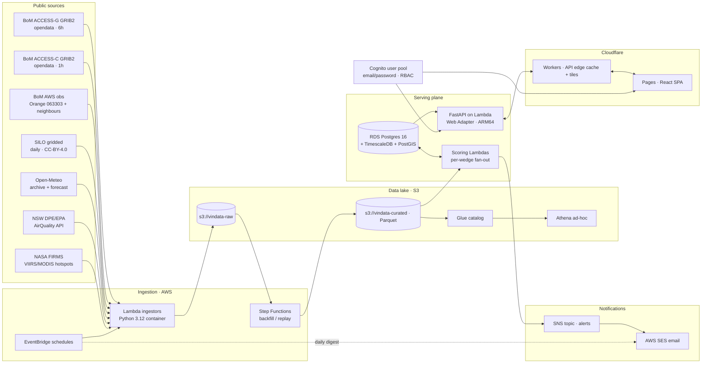

# VinData — Stage 01 Architecture

> **Scope**: PoC for Cargo Road + 5 nearby vineyards, Mount Canobolas / Orange NSW. Single AWS account `ap-southeast-2`. Public data only. All outputs labelled **advisory**.
>
> Companion docs: [`phases.md`](./phases.md) (delivery), [`critique-of-research.md`](./critique-of-research.md) (constraints carried from the existing research doc).

---

## A. System architecture

### A.1 Component diagram



### A.2 Raw lake partitioning

```
s3://vindata-raw/
  bom_access_g/dt=YYYY-MM-DD/cycle=HH/{var}.grib2
  bom_access_c/dt=YYYY-MM-DD/cycle=HH/{var}.grib2
  bom_obs/station=063303/dt=YYYY-MM-DD/obs.json
  silo/dt=YYYY-MM-DD/silo_orange.nc
  open_meteo/kind={forecast|archive}/dt=YYYY-MM-DD/orange.json
  air_quality/dt=YYYY-MM-DD/orange.json
  firms/dt=YYYY-MM-DD/au.csv
```

Curated Parquet (`s3://vindata-curated/`) mirrors the same source axis but is reshaped to long-form per-cell-per-hour records with `dt`, `vineyard_id`, `lead_h` partitions where useful. **No Iceberg at PoC** — straight Parquet + Glue crawler.

### A.3 Serving DB schema (Postgres 16 + Timescale + PostGIS)

```sql
-- Identity / tenancy
users(id uuid pk, email citext unique, role text check (role in ('viewer','vineyard_manager','admin')),
      cognito_sub text, created_at timestamptz);
vineyards(id smallserial pk, slug text unique, name text, region text,
          centroid geography(point,4326), tz text default 'Australia/Sydney',
          attribution_required bool default true);
blocks(id serial pk, vineyard_id int fk, name text, cultivar text,
       planted_year int, rootstock text, geom geography(polygon,4326),
       elevation_m real, aspect_deg real, slope_deg real);
user_vineyard(user_id uuid, vineyard_id int, role text, primary key(user_id,vineyard_id));

-- Timeseries (hypertables, 7d chunks)
weather_observations  -- BoM AWS + sensors later
  (station_id text, ts timestamptz, t2m real, rh real, wind_ms real,
   wind_dir real, rainfall_mm real, leaf_wetness_min smallint,
   primary key(station_id, ts));   -- hypertable on ts
weather_forecasts     -- ACCESS-G/C + Open-Meteo
  (vineyard_id int, model text, init_ts timestamptz, valid_ts timestamptz,
   t2m real, dewpoint real, rh real, wind_ms real, wind_dir real,
   precip_mm real, cloud_frac real, sw_rad real,
   primary key(vineyard_id, model, init_ts, valid_ts));   -- hypertable on valid_ts
agronomy_scores
  (vineyard_id int, block_id int null, wedge text,  -- 'frost'|'dm'|'pm'|'botrytis'|'smoke'|'pheno'
   ts timestamptz, lead_h smallint, score real, level text,  -- 'low'|'elevated'|'high'|'extreme'
   inputs_jsonb jsonb, model_version text,
   primary key(vineyard_id, wedge, ts, lead_h, coalesce(block_id,-1)));
phenology_state
  (block_id int, season smallint, ts date, gdd_cum real,
   bbch_stage smallint, eto_mm real, swb_mm real);
alerts
  (id bigserial pk, vineyard_id int, block_id int null, wedge text,
   level text, fired_at timestamptz, valid_for tstzrange,
   payload_jsonb jsonb, email_sent_at timestamptz);
audit_log(id bigserial, user_id uuid, action text, target jsonb, ts timestamptz);
```

Continuous aggregates: `weather_obs_hourly`, `weather_obs_daily`, `agronomy_daily_max` per wedge.

### A.4 API endpoints (FastAPI · OpenAPI 3.1 · RBAC via Cognito JWT)

```
GET  /v1/vineyards                                  -> list (scoped to caller)
GET  /v1/vineyards/{id}                             -> detail + blocks geojson
GET  /v1/vineyards/{id}/forecast?model=access_c&hours=72
GET  /v1/vineyards/{id}/observations?from=&to=&station=
GET  /v1/vineyards/{id}/scores?wedge=frost&from=&to=
GET  /v1/blocks/{id}/phenology?season=2025
GET  /v1/alerts?since=
POST /v1/alerts/{id}/ack
GET  /v1/admin/jobs                                 -> ingest run status (admin only)
GET  /v1/health
```

Cloudflare Worker in front: 60 s edge cache on `/forecast` and `/scores` (vary on JWT `sub`/role); pass-through on writes.

---

## B. Data flow per feature wedge

For all wedges: model output is written to `agronomy_scores` with `model_version` (SemVer, bumped on calibration change), and a hindcast notebook in `apps/ingest/notebooks/` proves the metric.

### B.1 Frost prediction (radiation + advection · 6 h / 3 h / 1 h)

- **Inputs**: `t2m`, `dewpoint`, `wind_ms`, `cloud_frac`, `sw_rad` from ACCESS-C (1 h cadence) + last 24 h obs from Orange AWS 063303; block elevation/aspect/slope from `blocks`.
- **Algorithm**: hybrid of
  - **(a) FFST radiation cooling** (Allen 1957 / Snyder & de Melo-Abreu 2005, *FAO Frost Protection*) for clear, calm conditions:
    `T_min ≈ T_d − k·sqrt(t)·(1 − c·cloud)·(1 − w·wind)`
    Coefficients calibrated via OLS on 5 y Orange AWS history.
  - **(b) Advective**: 850 hPa cold-air-advection flag from ACCESS-G + surface wind > 4 m/s + `T_adv − T_obs < −2 K`.
- **Block-level adjustment**: cold-air drainage proxy = `−0.6 · slope_pct` °C for low-elevation blocks under stable BL (Richardson > 0.25 from ACCESS-C BL diagnostics).
- **Output**: per-block `T_min_pred`, `frost_score = clip(0, 1, (2 − T_min_pred)/4)`. Levels: `<0.25 low`, `0.25–0.5 elevated`, `0.5–0.75 high`, `>0.75 extreme`. Alert when `T_min_pred ≤ −1 °C` and lead ≤ 6 h.
- **Validation**: hindcast 2019–2024 vs 063303 daily Tmin. **Targets**: MAE ≤ 1.2 °C; hit rate ≥ 0.8 / FAR ≤ 0.3 for `Tmin ≤ 0`.

### B.2 Disease pressure (DM · PM · Botrytis)

- **Downy mildew — DMCast** (Magarey & Wachtel; Magarey et al. 2002, *Plant Disease*).
  Hourly T, RH, leaf-wetness duration (LWD), rainfall. Primary infection when LWD ≥ critical hours `f(T)` per the published table (e.g. 12 h at 10 °C → 4 h at 22 °C). Cumulative DSV per Tom Caspari / UC Davis adaptation. LWD estimated via NEWA "CART" rule (`RH ≥ 90%` or `precip > 0.2 mm/h`) when no sensor.
- **Powdery mildew — Gubler-Thomas Risk Index** (Gubler et al. 1999, UC IPM). Index 0–100; +20 per day with 6 consecutive hours 21–29 °C; reset on day < 21 °C for 6 h or > 35 °C for 15 min. Spray-bracket thresholds 0–30 / 40–50 / 60–100 per UC IPM.
- **Botrytis — Broome / Gubler / Bettiga** (Broome et al. 1995, *Phytopathology*). Logistic on bloom-stage wetness duration & temperature: `P(infection) = 1 / (1 + exp(−(a + b·LWD + c·T·LWD)))` with the published *V. vinifera* coefficients.
- **Phenology gate**: PM and Botrytis only score when `BBCH ≥ 53` (inflorescence) for that block.
- **Output**: per-block daily score per disease. Alert when score crosses published threshold for two consecutive forecast days.
- **Validation**: hindcast 2018–2024 vs Orange/Borenore obs; cross-check DSV accumulation against AWRI/NSW DPI published seasonal write-ups; report Brier score & calibration plot. **Target**: reproduce UC IPM Gubler-Thomas example dataset to within ± 2 index points.

### B.3 Smoke-taint dose

- **Inputs**: NSW DPE/EPA `pm2_5` hourly at Orange / Bathurst / nearest stations; FIRMS hotspots within 500 km / 24 h; ACCESS-C `wind_ms`, `wind_dir`, BL height, surface stability.
- **Algorithm**: based on **Coulter et al. 2022** (*Aust. J. Grape & Wine Res.*) and Favell et al. 2021 thresholds for free volatile phenols. PoC implements an **exposure-dose proxy** (we cannot measure phenols directly):

  ```
  dose_index   = Σ_t  PM2.5(t) · stability_weight(t) · phenology_weight(BBCH(t))
  stability_weight = clip(0.5, 2.0, 1 / max(BL_height_km, 0.2))
  phenology_weight = 1.0 if BBCH ∈ [veraison..harvest] else 0.2
  ```

  Levels mapped from Coulter Table 2 PM2.5-hour bins (e.g. > 250 µg·h/m³ post-veraison ⇒ "high").
- **Output**: per-vineyard hourly dose + 7-day rolling. Alert when FIRMS hotspot < 100 km AND forecast wind vector intersects vineyard within 24 h.
- **Validation**: replay Black Summer 2019–20 and 2023 NSW events at Orange AWS. **Target**: dose peaks align with documented smoke-affected harvests in published AWRI reports for ≥ 80% of days with PM2.5 > 200 µg·h post-veraison.

### B.4 Phenology baseline

- **GDD**: Winkler (base 10 °C, no upper cap) and Huglin (heliothermal, base 10, latitude factor for −33.3°S). Cultivar-aware budbreak/flowering/veraison/harvest GDD targets from Wine Australia regional studies and Hall & Jones 2010.
- **BBCH stages**: **Caffarra & Eccel 2010** (*Int. J. Biometeorology*) for *V. vinifera* — two-phase chilling+forcing: dormancy release at `C* = 100` chill portions (Dynamic Model, Fishman) → forcing in GDD until each BBCH milestone.
- **ETo & soil water**: **FAO-56 Penman-Monteith** ETo (Allen et al. 1998); single-bucket SWB per block: `SWB(t+1) = clip(0, AWC, SWB + P − Kc·ETo)` with `Kc` curve from FAO-56 Table 12 (vineyards with cover crop).
- **Inputs**: hourly T, RH, wind, sw_rad, precip from SILO (historical) and ACCESS-C / Open-Meteo (forecast).
- **Output**: per-block daily `gdd_cum`, predicted BBCH, ETo, SWB. UI shows current stage + days-to-next-milestone.
- **Validation**: hindcast 2010–2024 budbreak/flowering at Orange against published phenological observations (Wine Australia; Cargo Road historical records if shared). **Target**: budbreak MAE ≤ 5 days.

---

## D. Key technical decisions

1. **Parquet + Glue, not Iceberg.** PoC volume (~50 GB/yr raw, < 5 GB curated) doesn't justify Iceberg's operational tax. Revisit at > 1 TB or when we need time-travel for model audits.
2. **TimescaleDB on RDS Postgres** for `weather_observations` and `weather_forecasts`. Hypertables + continuous aggregates make 5-year hindcast queries trivial; PostGIS in same DB removes a join across systems. Single `db.t4g.medium` is enough at PoC.
3. **Terraform** (not SST/CDK). We straddle AWS *and* Cloudflare; Terraform's Cloudflare provider is first-class while CDK's isn't. Remote state in S3 + DynamoDB lock.
4. **FastAPI on Lambda via Lambda Web Adapter (ARM64)**, not App Runner. Bursty traffic (15 users), pay-per-request, same packaging story as ingest Lambdas (container image). Same image runs locally / on App Runner later if traffic grows.
5. **GRIB2 with `xarray + cfgrib` (ecCodes)** in 3 GB Lambda containers, 10 min timeout. ACCESS-C single-cycle decode for the Orange tile fits in ~1.5 GB.
6. **BoM redistribution legality.** PoC keeps all BoM-derived bytes private behind Cognito; UI shows attribution "Contains Bureau of Meteorology data © Commonwealth of Australia"; no public API. See [`../../data-licensing.md`](../../data-licensing.md).
7. **Open-Meteo non-commercial tier** is fine for PoC (private, no revenue). Adapter is interface-driven so commercial endpoint is a config switch.
8. **React stack**: Vite + TS + TanStack Query + Zustand (minimal) + MapLibre GL + Recharts + shadcn/ui + Tailwind. **No Next.js** — Pages serves a static SPA + Worker API; no SSR needed.
9. **Monorepo (pnpm + turborepo)** with `apps/web`, `apps/api`, `apps/ingest`, `packages/agronomy`, `packages/shared-types`, `infra/`. Single PR can change schema → API → UI atomically; turbo cache keeps CI < 5 min.
10. **Secrets**: AWS Secrets Manager (DB creds, third-party API keys); SSM Parameter Store for non-secret config. Lambdas read at cold-start, cache per invocation.
11. **Observability**: structured JSON logs (`structlog`) → CloudWatch; OpenTelemetry SDK with OTLP exporter → X-Ray. Sentry for the React app. No Datadog at PoC.
12. **Advisory framing baked in.** A shared `<AdvisoryBanner>` React component is required on every page that renders a model output; an ESLint rule fails the build if `agronomy_scores` is rendered without it.

---

## E. Risks and mitigations

| Risk | Mitigation |
|---|---|
| **BoM commercial-use ambiguity.** Redistribution rules unclear for paid surfaces. | PoC is private behind Cognito, attribution rendered, no third-party API. `docs/data-licensing.md` tracks status. Phase 7 (post-PoC) blocked on signed MOU. |
| **Open-Meteo non-commercial tier** restricts revenue. | Acceptable while PoC is non-commercial. Source adapter is interface-driven; commercial endpoint switch is a config change. |
| **Spray-decision liability.** | UI labels every output "Advisory — not a spray decision". Email templates carry disclaimer. T&Cs require acknowledgement at sign-up. No UI element named "spray" or "go/no-go" until validated. |
| **Hindcast-only validation** limits scientific claims. | Documented in `docs/validation.md`; UI displays "Calibration: hindcast vs Orange AWS 2019–2024" tooltip on every score. Phase 7 plan: deploy 1–2 reference AWS or borrow Cargo Road station for prospective skill scoring. |
| **Single-region AWS (`ap-southeast-2`).** | Acceptable at PoC; nightly snapshot replicated to `ap-southeast-4`; Cloudflare keeps marketing/static page up; runbook documents 30-min RTO target. |
| **GRIB2 decode failures / source schema drift.** | Schema fingerprint per ingest run; alarm on missing variables; Step Function `backfill` allows replay; raw bytes preserved in S3 so we can re-curate. |
| **PII / compliance creep.** | Only emails + vineyard names stored; no AU Privacy Act sensitive categories; data residency `ap-southeast-2`; documented in privacy policy. |

---

## F. Repo / folder layout

```
vindata/
  README.md  LICENSE
  package.json  pnpm-workspace.yaml  turbo.json  tsconfig.base.json
  .github/workflows/{ci.yml, deploy.yml, preview.yml}
  docs/
    plan/stage-01/
      architecture.md          # this doc
      phases.md
      critique-of-research.md
    data-licensing.md
    validation.md
    runbook.md
    vindata-research-claude-01.md
  infra/                       # Terraform
    envs/{dev,prod}/
    modules/
      aws-network/  aws-rds-timescale/  aws-s3-lake/
      aws-lambda-fn/  aws-cognito/  aws-ses/
      cf-pages/  cf-worker/
    seed/
      vineyards.geojson        # 6 vineyards + blocks
  apps/
    web/                       # React + Vite + TS
      src/{pages,components,hooks,lib,types}/
      src/components/AdvisoryBanner.tsx
      vite.config.ts
      worker/                  # Cloudflare Worker (edge cache + tiles)
    api/                       # FastAPI on Lambda
      app/{routers,deps,models,services}/
      app/main.py
      Dockerfile
      alembic/
      pyproject.toml
    ingest/                    # one Lambda per source
      bom_access_c/  bom_access_g/  bom_obs/
      silo/  open_meteo/  air_quality/  firms/
      common/                  # shared boto3, retry, idempotency
      score_runner/            # fan-out per-vineyard scoring
      notebooks/               # hindcast validation
      Dockerfile
      pyproject.toml
  packages/
    agronomy/                  # pure Python: 4 wedges, no AWS deps
      src/agronomy/
        frost.py
        disease/{dmcast.py, gubler_thomas.py, broome_botrytis.py}
        smoke.py
        phenology/{caffarra_eccel.py, gdd.py, fao56_eto.py, swb.py}
        thresholds.py
        version.py
      tests/
      pyproject.toml
    shared-types/              # TS types from OpenAPI
      src/index.ts
      package.json
  scripts/
    gen-openapi.sh  seed-db.sh  backfill.sh
```

### Critical files (will be created during Phase 1–5)

- `infra/envs/dev/main.tf`
- `apps/api/app/main.py`
- `apps/api/alembic/versions/0001_init.py`
- `packages/agronomy/src/agronomy/frost.py`
- `apps/web/src/components/AdvisoryBanner.tsx`
